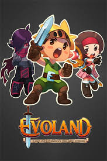
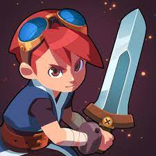

# Evoland & Evoland 2 : L'évolution du jeu de rôle

Evoland 1 et 2 sont des jeux de rôle qui offrent une aventure unique en explorant l'évolution des jeux vidéo, passant des graphismes 2D monochromes aux environnements 3D détaillés. Dans Evoland 1, les joueurs incarnent Clink et parcourent un monde en constante transformation pour sauver une princesse. Evoland 2 lui poursuit l'aventure en proposant une expérience plus complexe avec des époques différentes et une histoire captivante. Ces 2 jeux combinent habilement l'histoire, la nostalgie et l'évolution des jeux vidéo dans une expérience immersive.

## Evoland

**Description :** Evoland est un jeu de rôle qui vous permet de vivre l'évolution des jeux vidéo, depuis les graphismes monochromes jusqu'aux environnements 3D détaillés. Vous incarnez Clink, un héros qui parcourt un monde en constante évolution pour sauver sa princesse.

**Histoire :** Le jeu vous place aux commandes d’un personnage sans nom, très proche d’un Link de la série Zelda. Au début, il est pixélisé et en monochrome. Vous le croiriez tout droit sorti de votre vieille Gameboy grise qui doit prendre la poussière dans un carton de la cave de vos parents. Au début, il n’a pas le choix : il doit aller à droite. Les programmeurs n’ont en effet pas pensé à lui offrir deux directions. Il découvre un coffre. Il l’ouvre. Et voilà qu’il est capable d’aller à gauche. En allant à gauche, il découvre un autre coffre avec un autre mouvement. Et ainsi de suite. Jusqu’à trouver un coffre qui fait apparaître la musique, et ensuite la couleur. Vous venez de subir une évolution.
Le scénario vous amène à parcourir un monde où les coffres ne vous offrent pas simplement de nouvelles armes et de nouvelles capacités, mais aussi une perspective nouvelle sur le jeu vidéo. Les graphismes s’affinent avec le temps. Une nouvelle dimension apparaît. Les combats deviennent plus complexes. Le personnage se dote d’un inventaire et de la gestion de son arsenal. Et l’univers grandit. Véritable ode à la création vidéoludique, Evoland rend hommage à de nombreux titres qui ont marqué l’histoire du jeu, de Diablo à Final Fantasy, en passant par Legend of Zelda. Le jeu ne se prend pas au sérieux. Et pourtant, il ne l’a jamais été autant qu’ici.

**Info sur l'Achat :** Le jeu est assez léger (50 Mo sur iOS, 40 sur Android). Il est classé tout public. Il est compatible avec iOS 5.1.1 (ou supérieur) et Android 2.2 (et suivants). Il est payant, sans achat intégré, et coûte 5 euros sur l’App Store et 4,5 euros sur le Play Store (Apple a répercuté la hausse de la TVA et la baisse de l’euro face au dollar). Et il est presque trop court tellement il est bon. Si vous êtes frustré, sachez qu’un deuxième opus est en cours de développement chez Shiro Games, le studio à l’origine du jeu. Il devrait sortir dans un premier temps sur PC (sur Steam logiquement) avant d’arriver sur mobile.

- **Steam :** https://store.steampowered.com/app/233470/Evoland/?l=french

- **Google Play :** https://play.google.com/store/apps/details?id=air.com.shirogames.evoland12&hl=fr&gl=US&pli=1

## Evoland 2

**Description :** Evoland 2 est la suite du jeu original, offrant une expérience encore plus riche et variée. Vous explorerez différentes époques, rencontrerez de nouveaux personnages et découvrirez une histoire complexe et captivante.

